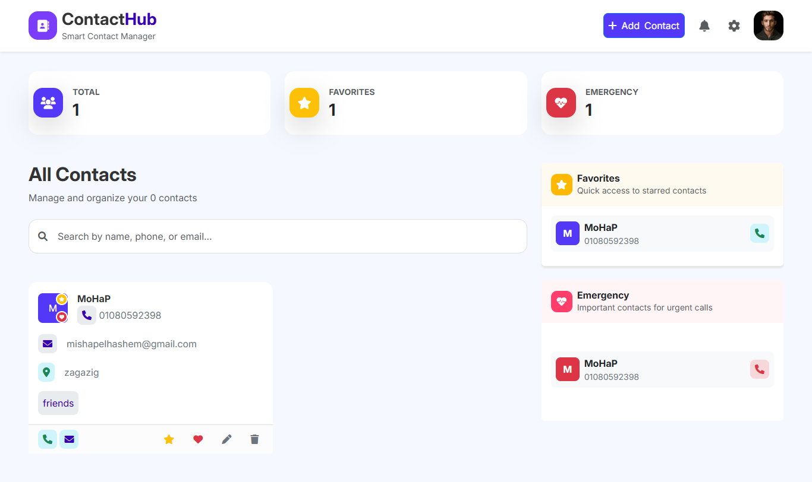

# 📝 Interactive CRUD Application
A lightweight and responsive interactive web application designed to manage data operations (**C**reate, **R**ead, **U**pdate, **D**elete) built with pure JavaScript (Vanilla JS), styled UI, enhanced user feedback via **SweetAlert2**, and persistent data storage using **Local Storage**.

## ✨ Features

- **Create:** Add new items seamlessly with input validation.
- **Read:** Display all stored data dynamically in a structured view/table.
- **Update:** Edit existing entries and reflect changes in real time.
- **Delete:** Remove specific entries with a **SweetAlert confirmation prompt** to prevent accidental deletion.
- **Local Storage Persistence:** Keeps data saved locally in the browser so it remains intact after page refreshes.
- **Interactive UI Notifications:** Clean modal alerts and action confirmations powered by SweetAlert2.
- **Responsive Design:** Fully responsive layout across mobile, tablet, and desktop screens.

## 🛠️ Tech Stack

- **HTML5:** Semantic structure and form elements.
- **CSS3:** Custom styles, modern layout techniques, and responsiveness.
- **JavaScript :** Core application logic, DOM manipulation, and Local Storage management.
- **SweetAlert2:** Beautiful, customized alert popups replacing native browser alerts.

## 📸 Screenshots

## 🚀 Live Demo
(https://mohab-elhashem.github.io/CRUD/)
